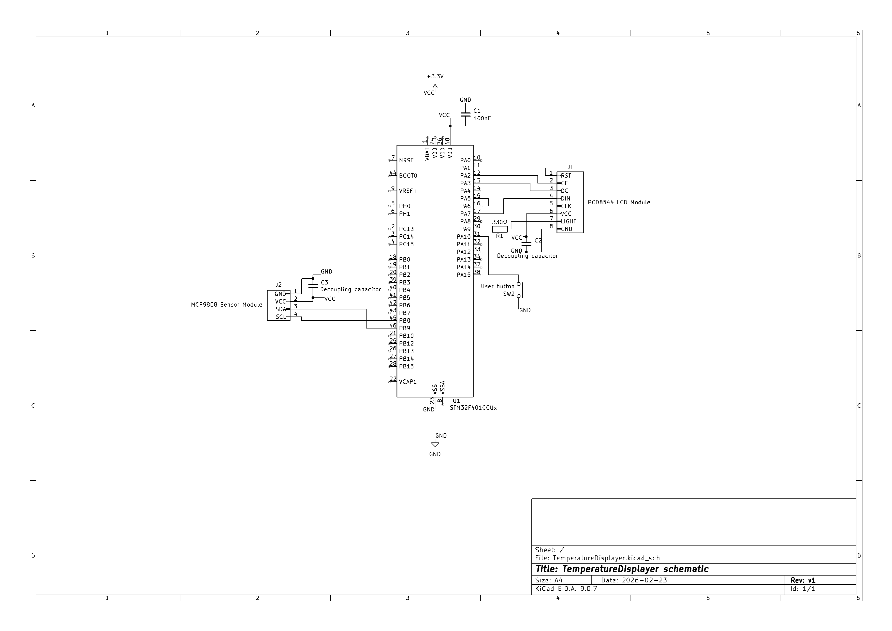

# TemperatureDisplayer Setup
This document contains the parts list, pinout configuration, schematic and some instructions for building the TemperatureDisplayer project.

## Hardware
### Part List (BOM)
| Count | Component               | Description               | Notes                                  |
|-------|-------------------------|---------------------------|----------------------------------------|
|   1   | STM32F401CCU            | Microcontroller           | MCU of this project                    |
|   1   | MCP9808                 | Temperature sensor        | From Seeed Studio Grove                |
|   1   | PCD8544                 | LCD Display               | People call it the Nokia 5110 Display  |
|   1   | Push button             | User input                | Connected to EXTI                      |
|   1   | Resistor 330Ω           | Backlight current limiter |                                        |
|   3   | Ceramic capacitor 100nF | Decoupling capacitors     |                                        |
|   16  | Jumper cable M-M        | Connect components        | Not all may be needed                  |
|   1   | Full sized breadboard   | To place components onto  | You could also use multiple small ones |
|   1   | ELEGOO Power MB V2      | Voltage regulator         | You can use an alternative if you want |

### Schematic
Below is the wiring schematic for the project:


## Software
### Cloning, Building and Flashing this project
#### 1. Prerequisites
**You need these installed on your system to build and flash this project:**
- ARM GCC toolchain
    - arm-none-eabi-gcc (tested with version 13.3.1)
- CMake (version 4.3.0 or higher)
- STM32CubeProgrammer (recommended), or alternative tools for flashing
- Ninja

*if you have STM32CubeIDE installed, you already have a working ARM toolchain*

#### 2. Clone the repository
From the directory you want to clone to:
```bash
git clone https://github.com/David-Dorito/TemperatureDisplayer.git TemperatureDisplayer
cd TemperatureDisplayer
```
This clones the project from the repo and puts bash into the project root.

#### 3. Configure the project
From the project root:
```bash
cmake --preset debug
```

#### 4. Build the project
Again from the project root:
```bash
cmake --build --preset debug
```
Output files (`TemperatureDisplayer.elf` importantly) will appear in the build/ directory

#### 5. Flashing
Flashing is not handled by CMake. Use one of the following tools to program the generated `.elf` file to the microcontroller:
- STM32CubeProgrammer
- STM32CubeIDE
- Any compatible ST-Link based flashing tool
